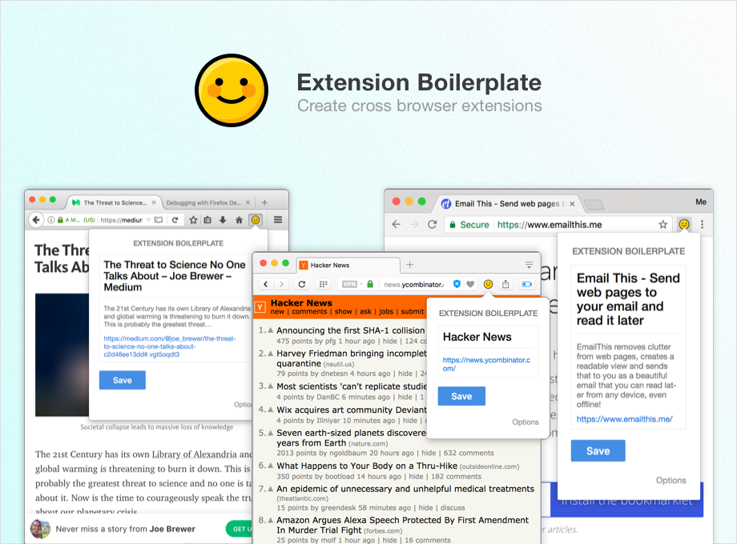

<div align="center">
  <h1>
    Band Protocol Browser Wallet
  </h1>

  <p>
    <strong>Official Browser Extensions for Band Chain</strong>
  </p>
</div>

Similarly to MetaMask, BandMask allows developers to build dApp UI on website. It exposes instance of Band Protocol Client to the web, and allows the dApp to communicate with blockchain without having to manage user wallet credentials itself.

<div align="center">
  <a href="https://www.emailthis.me/open-source/extension-boilerplate">
    
  </a>
</div>


## Features

<dl>
  <dt>Write once and deploy to Chrome, Opera & Firefox</dt>
  <dd>
    Based on WebExtensions. It also includes a tiny polyfill to bring uniformity to the APIs exposed by different browsers.
  </dd>
</dl>

<dl>
  <dt>Live-reload</dt>
  <dd>
    Your changes to CSS, HTML & JS files will be relayed instantly without having to manually reload the extension. This ends up saving a lot of time and improving the developer experience.
  </dd>
</dl>

## Installation

```sh
$> yarn install
$> yarn build
```

##### Load the extension in Chrome & Opera

1.  Open Chrome/Opera browser and navigate to chrome://extensions
2.  Select "Developer Mode" and then click "Load unpacked extension..."
3.  From the file browser, choose to `extension-boilerplate/build/chrome` or (`extension-boilerplate/build/opera`)

##### Load the extension in Firefox

1.  Open Firefox browser and navigate to about:debugging
2.  Click "Load Temporary Add-on" and from the file browser, choose `extension-boilerplate/build/firefox`

## Developing

The following tasks can be used when you want to start developing the extension and want to enable live reload -

- `npm run chrome-watch`
- `npm run opera-watch`
- `npm run firefox-watch`

## Packaging

Run `npm run dist` to create a zipped, production-ready extension for each browser. You can then upload that to the appstore.

## Special Thanks

Thank you Bharani, [Email This](https://www.emailthis.me), for providing a fantastic Boilerplate for this extension.

- [ ] Add support for Safari
- [x] Add Firefox & Opera Promo images
- [x] Add sample screenshot templates
- [ ] Write a guide for using config variables & JS preprocessor


